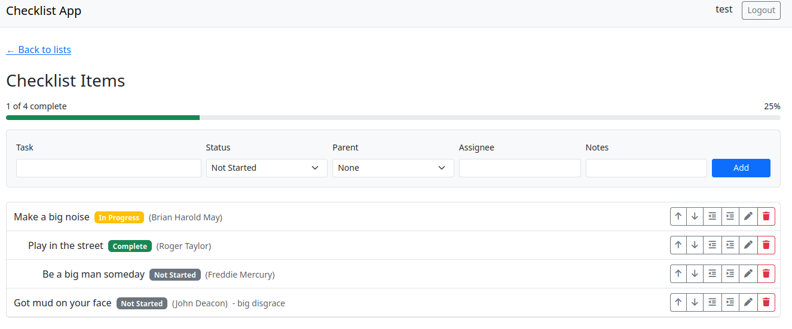
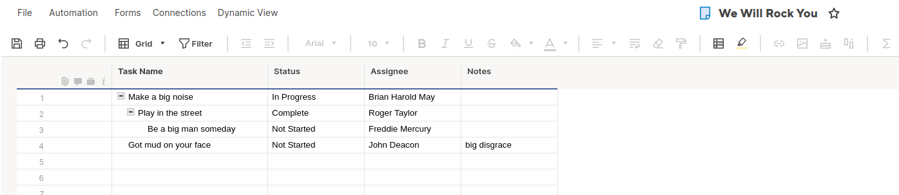

# Smartsheet Checklist App by Planeks

A web app for managing hierarchical task lists backed by Smartsheet.




## What I built

A checklist manager where each list is actually a Smartsheet sheet. You can create tasks, nest them under other tasks (indent/outdent), reorder them, and track status. All data lives in Smartsheet - the local database only stores user accounts and sheet references.

**Why a checklist app?** I looked at SoftwareX's Smartsheet integrations page and noticed you support a lot of different platforms. That means onboarding new customers probably involves multiple steps across different systems. A hierarchical checklist seemed like a practical tool for that kind of workflow - break down "Onboard Customer X" into phases, each phase into tasks, track progress as you go.

## Running it

```bash
# Copy env file and add your settings
cp dev.env .env

# Start with Docker
docker compose -f compose.dev.yml up --build

# App runs at http://localhost:8000
# Frontend at http://localhost:5173
```

You'll need a Smartsheet API token. Register in the app and paste your token during registration - the app stores it encrypted and uses it for all your Smartsheet operations.

## How it works

The backend is Django with DRF. The frontend is React with Vite.

When you create a checklist, the app creates a real Smartsheet sheet with four columns: Task Name, Status, Assignee, Notes. All the hierarchy stuff (indent, outdent, reorder) uses Smartsheet's native parent_id field, so the nesting is real in Smartsheet, not faked in the UI.

```
Request flow:

React -> Django API -> SmartsheetGateway -> Smartsheet API
                                |
                         Returns updated tree
```

The gateway abstracts the Smartsheet SDK. Use cases handle business logic. Views wire HTTP to use cases.

## What I prioritized

**Hierarchy that actually works.** Indent, outdent, move up, move down. The trickiest part was figuring out sibling relationships from Smartsheet's flat row list - they come back in display order, which I rely on for determining siblings.

**Per-user tokens.** The spec said I could assume a token in an env var, but I had an auth boilerplate ready, so I used it. Each user stores their own Smartsheet token, encrypted with AES-256. Took maybe 15 minutes to integrate, and it means multiple people can use the app with their own Smartsheet accounts.

**Optimistic UI.** The frontend updates immediately when you click indent/move/delete, then rolls back if the API fails. Makes the app feel faster than waiting for Smartsheet's response.

**Error handling.** The backend catches Smartsheet errors (rate limits, maintenance, timeouts) and returns proper HTTP codes. The frontend shows the message and offers a retry button for transient failures.

**Credential security.** Smartsheet tokens are encrypted with AES-256 before storing in the database. The encryption key is loaded from environment variables, never hardcoded.

## What I skipped

**Tests.** The gateway and use cases are testable - I'd mock the Smartsheet client and verify the right SDK methods get called with the right arguments.

**Drag and drop.** The spec listed this as a non-goal, so I stuck with buttons. Easier to get right and predict consumed time.

## Architecture decisions

I used a layered structure inspired by Clean Architecture and DDD approaches in the `checklist` app:

- **Gateway** abstracts the Smartsheet SDK. If the SDK changes or I need to swap providers, only one file changes.
- **Use cases** contain business logic (indent rules, sibling relationships). They're testable without hitting the API.
- **Views** just wire HTTP to use cases - no business logic leaks into the web layer.

Why bother with this for a small app? It pays off. When the indent logic had bugs, I could debug TreeBuilder without thinking about HTTP or Smartsheet. If I needed to add a CLI later, the use cases wouldn't change. And if another developer joined, they could work on a new use case while I fix the gateway - no merge conflicts. Layers separate concerns, are testable, and have a single reason to change.

## What I'd change with more time

**Webhook-based caching.** Right now every page load hits the Smartsheet API. I'd register a webhook per sheet, cache item data locally, and re-fetch only when Smartsheet notifies of changes. I explored Smartsheet's conditional request support but didn't find a reliable solution in time, so left it for later.

**Tests.** Unit tests for the gateway (mock the Smartsheet SDK), integration tests for the use cases. The architecture makes this straightforward - gateway is injectable, use cases are pure logic.

## Smartsheet quirks I ran into

**Row ordering.** Smartsheet returns rows in display order, but there's no explicit "order" field. I depend on this for sibling calculations. If they ever change that behavior, things break.

**Parent ID on create.** When you add a row with a parent_id, it goes to the bottom of that parent's children. You can't specify "add as first child" without a second API call to reorder. Also, parent_id can't be None when creating a row - you have to omit it entirely for root-level items.

**Column IDs.** You can't reference columns by name in the SDK - you need numeric IDs.

## Stack

- Python, Django, DRF
- React, Vite, Bootstrap
- smartsheet-python-sdk
- Docker for local dev

SQLite for the database. Keeps the Docker setup simple - no Postgres container to configure. The local DB only stores user accounts and sheet references anyway, all the real data is in Smartsheet. For production I'd swap it for Postgres, but for a demo it's one less thing to set up.

I used my own boilerplate to speed things up. The `.github` folder and deployment scripts are leftovers from that - I left them in to show my typical approach to CI/CD and automated deployment, though they're not wired up for this project.

Code style is enforced via pre-commit hooks: Ruff for Python formatting and linting (fast, catches more than flake8), isort for import ordering, and Prettier for JavaScript. There's also a `make format` command that runs all three inside Docker. I prefer automated formatting over style debates - set it once, forget about it.
